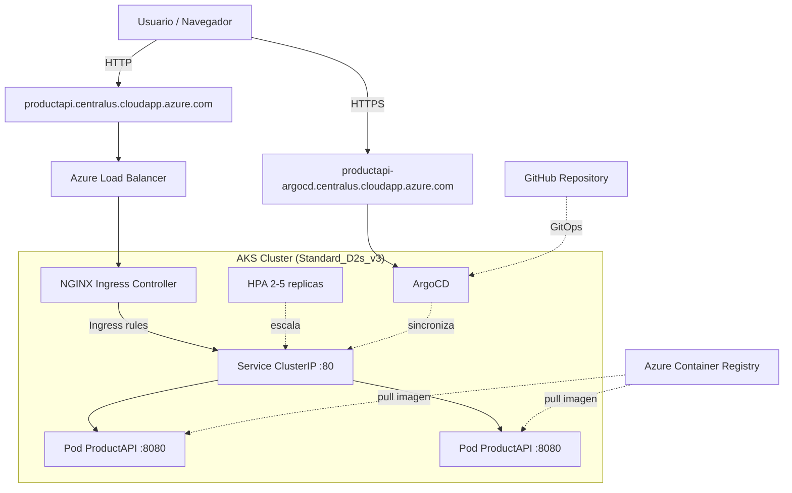
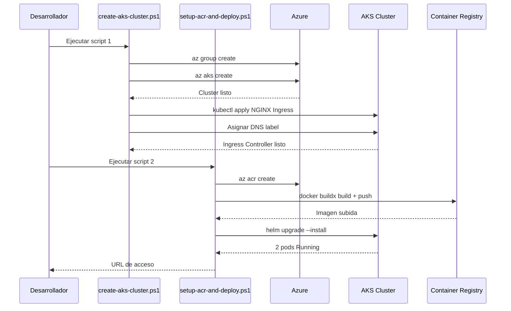
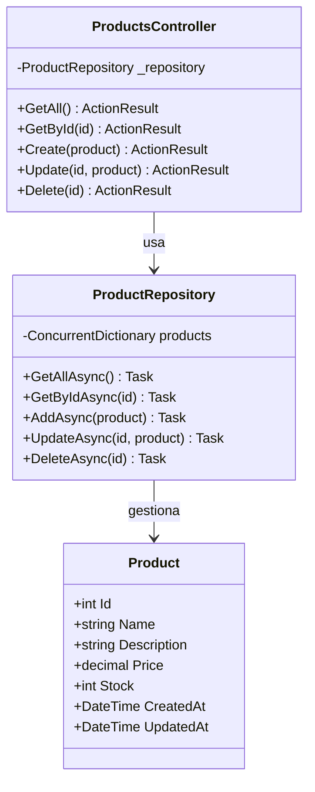
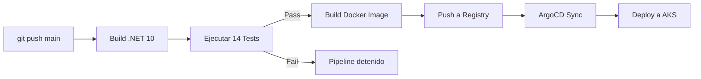

# UnisabanaArq1Grupo2PatronesActividad3

## Presentacion de la Actividad

Asignatura: Arquitectura de Software
Profesor: Daniel Orlando Saavedra Fonnegra

Integrantes del grupo:

- Pablo Andres Melo Garcia
- Camilo Andres Padilla Garcia
- Edison Kenneth Campos Avila
- Cristian Alonso Cardona Vega
- Jorge Andres Ayala Valero
- John Harold Diaz Gonzalez

## Demo: Microservicio con Despliegue en Kubernetes (Azure AKS)

Este proyecto implementa un microservicio REST API en .NET 10 con despliegue completo en Kubernetes usando Azure AKS. Incluye:

- **Microservicio**: API REST CRUD de productos con health check
- **Docker**: Imagen multietapa optimizada para produccion
- **Kubernetes**: Orquestacion con Helm Charts (Deployment, Service, Ingress, HPA)
- **CI/CD**: Pipeline automatizado con GitHub Actions
- **GitOps**: Configuracion de ArgoCD para sincronizacion automatica
- **Infraestructura**: Scripts de despliegue automatizado en Azure AKS

### Diagrama de Arquitectura de Infraestructura



### Diagrama de Flujo de Despliegue



### Diagrama de Arquitectura del Microservicio



### Diagrama de Pipeline CI/CD



### Estructura del Repositorio

```
src/
  ProductAPI/                  Codigo fuente del microservicio
    Controllers/               ProductsController (5 endpoints + health)
    Models/                    Entidad Product
    Repositories/              ProductRepository (in-memory)
    Program.cs                 Configuracion de la aplicacion
  ProductAPI.Tests/            14 pruebas unitarias (xUnit + Moq)
docker/
  Dockerfile                   Imagen multietapa (SDK build -> runtime)
helm/
  Chart.yaml                   Metadata del chart
  values.yaml                  Valores por defecto
  templates/
    deployment.yaml            Kubernetes Deployment
    service.yaml               Kubernetes Service (ClusterIP)
    ingress.yaml               NGINX Ingress (acceso por IP)
    hpa.yaml                   Horizontal Pod Autoscaler (2-5 replicas)
azure/
  create-aks-cluster.ps1       Crear cluster AKS + NGINX Ingress + DNS
  setup-acr-and-deploy.ps1     Crear ACR, build imagen, deploy con Helm
  delete-all-resources.ps1     Eliminar todos los recursos
argocd/
  namespace.yaml               Namespace de ArgoCD
  application.yaml             Application manifest
.github/workflows/
  ci-cd.yml                    Pipeline CI/CD (build, test, Docker, deploy)
```

### Despliegue en Azure AKS

#### Requisitos previos

- Azure CLI (`az login` autenticado)
- Docker Desktop
- kubectl
- Helm 3

#### Ejecucion

Abrir PowerShell en la raiz del proyecto y ejecutar en orden:

```powershell
# 1. Eliminar recursos existentes (si los hay)
.\azure\delete-all-resources.ps1

# 2. Crear cluster AKS + NGINX Ingress con DNS de Azure (~10 min)
.\azure\create-aks-cluster.ps1

# 3. Crear ACR, build imagen, desplegar con Helm (~8 min)
.\azure\setup-acr-and-deploy.ps1
```

Al finalizar, la API queda accesible en:

```
http://productapi.centralus.cloudapp.azure.com/api/products/health
http://productapi.centralus.cloudapp.azure.com/api/products
```

### Acceso a ArgoCD (GitOps Dashboard)

ArgoCD esta instalado en el cluster y expuesto publicamente:

| | |
|---|---|
| **URL** | `https://productapi-argocd.centralus.cloudapp.azure.com` |
| **Usuario** | `admin` |
| **Password** | Obtener con: `kubectl -n argocd get secret argocd-initial-admin-secret -o jsonpath="{.data.password}" \| base64 -d` |

ArgoCD sincroniza automaticamente los cambios del repositorio Git al cluster (auto-sync + self-heal).

### CI/CD Verificado

| Componente | Estado | Detalle |
|------------|--------|---------|
| GitHub Actions | ✅ Funcionando | Build, test (14/14), Docker build/push |
| ArgoCD | ✅ Synced + Healthy | Sincronizacion automatica desde Git |
| Pruebas Unitarias | ✅ 14/14 pasando | xUnit + Moq |

### Endpoints de la API

| Metodo | Endpoint | Descripcion |
|--------|----------|-------------|
| GET | `/api/products` | Listar todos los productos |
| GET | `/api/products/{id}` | Obtener producto por ID |
| POST | `/api/products` | Crear nuevo producto |
| PUT | `/api/products/{id}` | Actualizar producto |
| DELETE | `/api/products/{id}` | Eliminar producto |
| GET | `/api/products/health` | Health check |

### Prueba de endpoints

```bash
# Health check
curl http://productapi.centralus.cloudapp.azure.com/api/products/health

# Listar productos
curl http://productapi.centralus.cloudapp.azure.com/api/products

# Crear producto
curl -X POST http://productapi.centralus.cloudapp.azure.com/api/products \
  -H "Content-Type: application/json" \
  -d '{"name":"Mouse","description":"Mouse inalambrico","price":29.99,"stock":50}'

# Obtener por ID
curl http://productapi.centralus.cloudapp.azure.com/api/products/1

# Actualizar
curl -X PUT http://productapi.centralus.cloudapp.azure.com/api/products/1 \
  -H "Content-Type: application/json" \
  -d '{"name":"Mouse Pro","description":"Mouse gaming","price":49.99,"stock":30}'

# Eliminar
curl -X DELETE http://productapi.centralus.cloudapp.azure.com/api/products/1
```

Ejemplo de respuesta del health check:

```json
{
  "status": "healthy",
  "timestamp": "2026-03-01T22:43:00.271Z"
}
```

Ejemplo de respuesta de productos:

```json
[
  {
    "id": 1,
    "name": "Laptop",
    "description": "Laptop de alto rendimiento",
    "price": 1299.99,
    "stock": 10,
    "createdAt": "2026-03-01T22:24:24.979Z",
    "updatedAt": "2026-03-01T22:24:24.979Z"
  }
]
```

### Que demuestra este proyecto

- **Microservicio funcional**: API REST CRUD completa con pruebas unitarias
- **Contenedorizacion**: Docker multietapa optimizado para produccion
- **Orquestacion**: Kubernetes con Helm Charts configurables y auto-scaling
- **Ingress**: NGINX como punto de entrada unico con DNS de Azure
- **CI/CD**: Pipeline automatizado con GitHub Actions - ✅ Verificado
- **GitOps**: ArgoCD sincronizando automaticamente desde Git - ✅ Synced + Healthy
- **Infraestructura como codigo**: Scripts reproducibles para crear y destruir el entorno completo

### Eliminar recursos (evitar costos)

```powershell
.\azure\delete-all-resources.ps1
```

### Tecnologias utilizadas

| Tecnologia | Version / Detalle |
|------------|-------------------|
| .NET | 10.0 |
| ASP.NET Core | Minimal API + Controllers |
| Docker | Buildx, multietapa |
| Kubernetes | AKS v1.33 |
| Helm | 3.x |
| NGINX Ingress | Controller v1.9.4 |
| Azure | AKS + ACR (suscripcion estudiante) |
| GitHub Actions | CI/CD Pipeline |
| ArgoCD | GitOps |
| xUnit + Moq | 14 pruebas unitarias |

### Bibliografia

- [Microsoft Docs: Azure Kubernetes Service](https://learn.microsoft.com/en-us/azure/aks/)
- [Kubernetes Documentation](https://kubernetes.io/docs/)
- [Helm Documentation](https://helm.sh/docs/)
- [NGINX Ingress Controller](https://kubernetes.github.io/ingress-nginx/)
- [ArgoCD Documentation](https://argo-cd.readthedocs.io/)
- [Docker Multi-stage Builds](https://docs.docker.com/build/building/multi-stage/)
